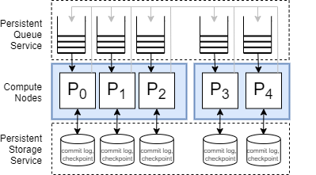

# Netherite: Introduction

Netherite is a distributed workflow execution engine for [Durable Functions](https://github.com/Azure/azure-functions-durable-extension) (DF) and the [Durable Task Framework](https://github.com/Azure/durabletask/) (DTFx). 

It is of potential interest to anyone developing applications on those platforms who has an appetite for performance, scalability, and reliability. 

As Netherite is intended to be a drop-in backend replacement, it does not modify the application API. Existing applications can switch to this backend with little effort.

## Getting Started

To get started, you can either try out the sample, or take an existing DF app and switch it to the Netherite backend.

**The hello sample.**
For a quick start, take a look at [hello sample](#/hello-sample.md). We included scripts that make it easy to build, run, and deploy this application. Also, this sample is a great starting point for creating your own projects.

**Configure an existing DF app to use Netherite.**
If you have a .NET Durable Functions application already, and want to configure it to use Netherite as the backend, do the following:
- Add the NuGet package `Microsoft.Azure.DurableTask.Netherite.AzureFunctions` to your functions project.
- Create an EventHubs namespace. You can do this in the Azure portal, or using the Azure CLI.
- Configure `EventHubsConnection` with the connection string for the Event Hubs namespace. You can do this using an environment variable, or with a function app configuration settings.
- Modify the host.json to select Netherite as your provider. See [settings for Netherite](#/settings.md).

## Why a new engine?

The default Azure Storage engine stores messages in Azure Storage queues and instance states in Azure Storage tables. It executes large numbers of small storage accesses. For example, executing a single orchestration with three activities may require a total of 4 dequeue operations, 3 enqueue operations, 4 table reads, and 4 table writes. Thus, the overall throughput quickly becomes limited by how many I/O operations Azure Storage allows per second. 

To achieve better performance, Netherite represents queues and partition states differently, to improve batching:
- Partitions communicate via ordered, persistent event streams, over EventHubs.
- The state of a partition is stored using a combination of an immutable log and checkpoints, in Azure PageBlobs.

Just as in the [previous architecture](https://docs.microsoft.com/en-us/azure/azure-functions/durable/durable-functions-perf-and-scale#orchestrator-scale-out), partitions are load-balanced at runtime over the available nodes. However, unlike before, Netherite partitions apply to both activities and orchestrations, so there is not a distinction between control queues and work-item queues.

The following picture illustrates the architecture, in a situation where five partitions are distributed over two nodes:

Each partition is represented in storage using the FASTER database technology, which also provides basic indexing and querying. We discuss this in more detail in the section on [storage organization](#/storage-organization.md).

Another advantage of this architecture is that we can store the current input queue position of a partition as part of the partition state. This is important in cases where we need to recover from a crash, or if we need to move a partition from one node to another. In those situation, the node that is restarting the partition can check the input position of the last processed message, and resume processing exactly where it left off. 

**Components.** Currently, Netherite relies on the following services:
- *EventHubs* provides the persistent queue service.
- *Azure Storage Page Blobs* provide the underlying raw storage for the logs.

In the future, we plan to support alternatives for these components. For example, Kafka instead of EventHubs, and K8s persistent volumes instead of Azure Page Blobs.

## Status

The current version of Netherite is *0.3.0-alpha*.  Netherite already support almost all of the DT and DF APIs. However, there are still some limitations that we plan to address in the near future, before moving to beta status:

- **Supported hosted plans**. Consumption plan is not supported yet, and auto-scaling only works on Elastic Premium plans so far. 
- **Query Performance**. We have not quite completed our implementation of a FASTER index to speed up queries that are enumerating or purging instance states.
- **Stability**. We do not recommend using Netherite in a production environment yet; although we have found and fixed many bugs already, we need more testing before moving to beta status. Any help from the community is greatly appreciated!
