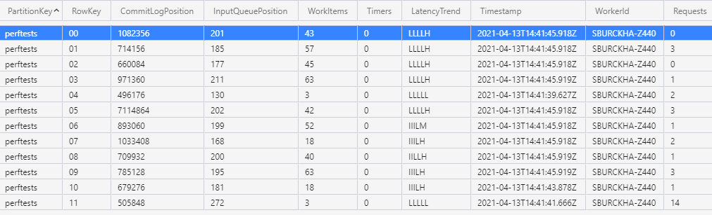

# Partition Table

Whenever a taskhub is running, it publishes load information for each partition to an Azure Storage table called `DurableTaskPartitions`.
This table can be inspected in Microsoft Azure Storage Explorer. For example, it may look as follows:

Each row corresponds to one partition, and is updated about every 10 seconds while the functionapp is running, by the node on which that partition is currently hosted. Rows are not written if the content is unchanged (such as when the partition has been idle for a while). If the functionapp is running but a row is not updated, it can mean that the partition is experiencing some issues.

## Table Fields

The meaning of the columns is:

|Column Name | Meaning |
|--|--|
|PartitionKey| The name of the taskhub. |
|RowKey| The partitionId of this partition. |
|WorkerId| The name of the machine that is hosting this partition. |
|Timestamp| The time at which this row was written.  |
|LatencyTrend| A sequence of up to five letters, each one indicating load during a publishing interval. Every time the row is written, a new letter is appended on the right, so reading them from left to right indicates the latency trend. I means idle, L means low latency (less than 100ms), H means medium latency (between 100 and 1000ms), and H means high latency (above 1000ms).|
|CommitLogPosition| The position (in bytes) of the commit log. This is monotonically increasing, and advances every time the partition state changes. |
|InputQueuePosition| The position of the EventHubs input queue. This is monotonically increasing, and advances every time a message is processed. |
|WorkItems| The number of currently pending activity and orchestration work items. |
|Timers| The number of currently pending timers. |
|Timers| The time at which the next timer will fire. |
|Requests|  The number of currently pending client requests. |

## Changing the table name
The name of the partition table can be controlled by specifying the `LoadInformationAzureTableName` parameter in host.json.
