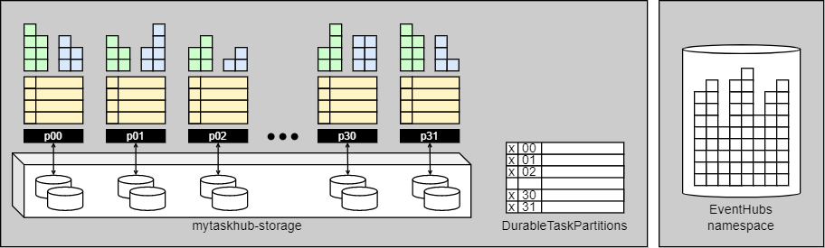

# Storage Resources

Netherite automatically manages the state of the application by maintaining various resources in storage, using the connection strings defined in `AzureWebJobsStorage` and `EventHubsConnection`.

?> **Concept** The durable application state is organized into a logical unit called a [task hub](https://docs.microsoft.com/en-us/azure/azure-functions/durable/durable-functions-task-hubs?tabs=csharp). 
A task hub is automatically created the first time the service is started. Once created, a taskhub persists in storage, unless explicitly deleted. This is intentional; it guarantees durability of the state of orchestrations and entities.

When running Netherite, the following storage resources are used:

1. An **Azure Storage Account**, which contains
   1. An **Azure Storage Blob Container** called `XXX-storage` (where XXX is the taskhub name). This container stores the current state of all orchestrations and entities. The state is encoded inside multiple block- and page-blobs and is not human-readable for the most part, as it is optimized for efficient I/O using FasterKV and FasterLog.
   1. An **Azure Storage Table** called `DurableTaskPartitions`. This table stores metrics in a human-readable format. It is used for diagnostic purposes and autoscaling.
1. An **Event Hubs Namespace**, which contains several event hubs that serve as channels for transmitting messages between partitions and clients.

The role of the Event Hubs namespace is to load-balance partitions of a single task hub, and to allow partitions and clients to communicate.

!> **Important** Never use the same Event Hubs namespace for multiple function apps at the same time.

### Task Hub Restart

If you want to restart the application from a clean, empty state, some common ways to achieve this are:

1. *Change the task hub name*. This leaves the state of the previous task hub untouched, and simply creates a new one.
1. *Delete the blob container*. Be aware that after deleting a container, Azure Storage may refuse to recreate it for a minute or so, which can be inconvenient if you want to restart the function app right away.
1. *Delete all the blobs inside the blob container*. Since there is no simple command for this, it requires some tool or script and may take while.
1. *Delete just the `XXX-storage/taskhubparameters.json` blob*. This prompts the runtime to create a new taskhub. It leaves some garbage behind in storage, but there are no other negative consequences, and this is therefore often convenient for quick iteration during testing.

### Task Hub Deletion

Once you are finished using a task hub, it is advisable to delete the associated resources to avoid billing charges. 
Note that Event Hubs billing accumulates charges for the reserved capacity measured in throughput units, or TU. In particular, the number of partitions, or the amount of data stored in them, does not matter.

### Event Hubs Retention

All instance and activity messages that are part of the task hub contents are reliably stored in the partition storage. In particular,
* it is not necessary to retain Event Hubs messages past their default expiration time.
* it is safe to delete all the event hubs in the namespace, or to change the configuration to use a different namespace.

### Storage Representation Details

A task hub is automatically created by Netherite when the application is started the first time. Specifically,

- A blob container named `<taskhubname>-storage` is created in the storage account specified by `AzureWebJobsStorage`.
- A blob named `taskhubparameters.json` is written to the blob container. You can inspect this file to see the properties of the task hub.
- The following event hubs are created (or recreated) in the namespace specified by `EventHubsConnection`.
  - An event hub called `partitions` with 1-32 partitions.
  These are used to deliver messages to the Netherite partitions, reliably and in order. There is a one-to-one correspondence between the partitions of this event hub and the Netherite partitions.
  The number of Netherite partitions is determined by the setting of the `PartitionCount` property in the [settings](settings.md) at the time the taskh ub is created, which defaults to 12. Once the task hub has been created, the partition count can no longer be changed.
  - An event hub called `loadmonitor` with 1 partition.
  This is used to send information to the load balancer.
  - Four event hubs called `clients0`, `clients1`, `clients2` and `clients3` with 32 partitions each.
  These are used for sending responses back to clients. By design, we use vastly more partitions (128) than the expected number of clients.
  The reason is that clients hash to these partitions randomly, and we want reduce the likelihood of hash conflicts.
- Several partition folders and initial checkpoints are written to the blob container.

Additionally, if the option `TraceToBlob` is set to true in the [settings](settings.md), a **logs** container is automatically created. It contains append blobs that capture traces generated by each node. A new blob is started everytime a node (re)starts. This logging feature is intended for debugging purposes during development and has not been hardened for production deployments.

Note that deleting the event hubs or the namespace does not delete task hub; rather, the task hub automatically recovers its state if its event hub is lost, or if events have expired and were thrown away.

?> **Tip** You can manually delete the 'partitions' event hub of a running application to immediately force a restart of all partitions. This can be useful at times; One can consider this the equivalent of "fixing" a stuck mechanical machine by giving it a kick.
