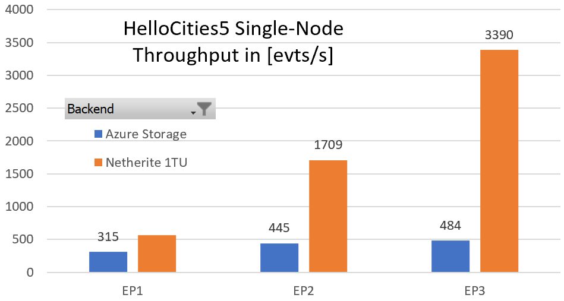

# Throughput testing

The following tests demonstrate the performance characteristics of Netherite, and compare them to the legacy Azure Storage backend. 

> Results may vary due to many factors; we do not claim to guarantee specific numbers. We encourage you to run these tests yourself, and tweak them for your purposes.

To make throughput easier to compare between benchmarks, we report it in terms of **events per second**. Each orchestration event represents a one way messaging operation. For example, calling an activity function and handling the response is two distinct events. Resuming from a durable timer, or receiving an external event, are also considered one orchestration event.

**How the experiment is run.** We use a single HttpTrigger which starts all the orchestrations. After they have all completed, we look at the start time (creation timestamps) and end time (last-updated timestamp) of each orchestration instance, and compute the test duration by subtracting the earliest creation time from the latest completion time. 

**How throughput is measured.** The throughput, in events per second, is then 

>  throughput = (events per orchestration) * (number of orchestrations) / (test duration)

This represents the average throughput over the whole experiment. This is typically less than then peak throughput because towards the end, fewer orchestrations are left running than at the beginning.

## HelloCities5 Benchmark

This benchmark performs a large number of independent orchestrations concurrently. Each orchestration calls 5 activities in sequence. The activities are very short - there is no significant CPU work being done. We use this benchmark as an indicator for the "orchestration step" throughput, i.e. how efficiently orchestration progress is persisted to storage.

### Single Node Throughput

For the single-node tests, we measure how much throughput a single node achieves, for each backend.

* Number of nodes: **1**
* Scenario: **HelloCities5**
* Number of orchestrations: **1000**
* Events per orchestration: **10**
* Functions runtime: **3.0**
* Region: **West US 2**
* Hosting plan: **[Elastic Premium](https://docs.microsoft.com/azure/azure-functions/functions-premium-plan)**
* Scale setting for EventHubs: **1 TU** (throughput unit)
* Number partitions: **12** for Netherite, **4** for Azure Storage
* Operating system: **Windows**
* Application Insights: **Enabled, warnings only**
* Host configuration: **See the [host.json](https://github.com/microsoft/durabletask-netherite/blob/main/test/PerformanceTests/host.json) file**
* Version: **v0.2.0-alpha**
* Date: **02/08/2021**

| Compute | Backend | Total time (sec) | Events/sec |
|-|-|-|-|
| EP1 (1-core) | Netherite (1TU) | 17.7 | 565 |
| EP1 (1-core) | Azure Storage   | 31.7 | 315 |
| EP2 (2-core) | Netherite (1TU) | 5.9| 1708 |
| EP2 (2-core) | Azure Storage   | 22.5 | 445 |
| EP3 (4-core) | Netherite (1TU) | 3.0 | 3390 |
| EP3 (4-core) | Azure Storage   | 20.7 | 484 |

Some takeaways:

* Netherite is about 2x faster than Azure Storage on EP1.
* Netherite is about 7x faster than Azure Storage on EP3.
* Netherite on EP1 is faster than Azure Storage on EP3.
* Netherite shows hyperlinear benefits from scaling up.
* A single throughput unit (1TU) is sufficient for all the single-node experiments.

